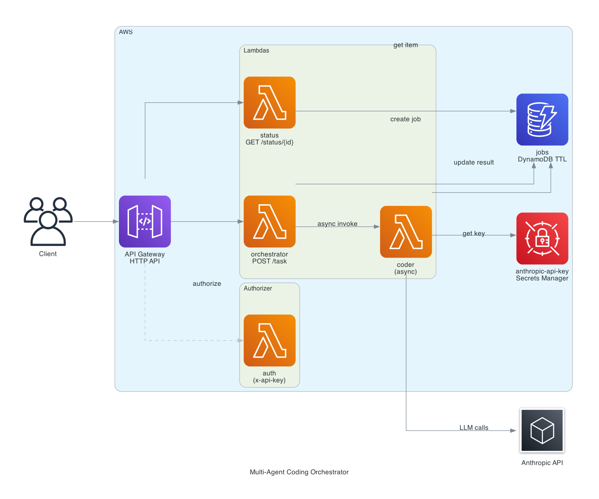

# multi-agent-coder

A multi-agent system deployed on AWS Lambda that routes natural language coding tasks to specialist agents via an orchestrator. The system is fully asynchronous: tasks are accepted immediately, processed in the background, and results are retrieved via polling. Built with the Anthropic SDK tool-use pattern and fully provisioned with Terraform.

## Architecture



```
Client (x-api-key header required)
  POST /task
    API Gateway (HTTP API)
      Auth Lambda (REQUEST authorizer, 5-min cache)
      Orchestrator Lambda (sync, <2s)
        creates job in DynamoDB (status: pending)
        invokes Coder Lambda async (fire and forget)
        returns 202 + job_id

  GET /status/{job_id}
    API Gateway
      Auth Lambda (REQUEST authorizer, 5-min cache)
      Status Lambda
        reads job from DynamoDB
        returns status + result

  Coder Lambda (async, runs independently)
    fetches API key from Secrets Manager (cached)
    agentic tool-use loop (up to 10 iterations)
      write_code | explain_code | debug_code
    writes result to DynamoDB (status: complete | error)
```

## Supported task types

| Type         | Example prompt                                                        |
| ------------ | --------------------------------------------------------------------- |
| write_code   | "Write a Python function that flattens a nested list"                 |
| explain_code | "Explain what this Go function does: ..."                             |
| debug_code   | "Debug this JavaScript: ... Error: Cannot read property of undefined" |

## Project structure

```
multi-agent-coder/
├── agents/
│   ├── orchestrator.py       job creation, async coder dispatch
│   └── coder.py              agentic tool-use loop, writes result to DynamoDB
├── tools/
│   ├── registry.py           Anthropic tool schemas
│   └── code_tools.py         write_code, explain_code, debug_code implementations
├── handlers/
│   ├── orchestrator_handler.py   POST /task entrypoint, returns 202
│   ├── coder_handler.py          async Lambda entrypoint, passes job_id to coder
│   ├── status_handler.py         GET /status/{job_id} entrypoint
│   └── auth_handler.py           API Gateway REQUEST authorizer (x-api-key)
├── terraform/
│   ├── main.tf               provider, S3 backend
│   ├── variables.tf
│   ├── terraform.tfvars      non-sensitive defaults
│   ├── secrets.tfvars        API key (gitignored)
│   ├── dynamodb.tf           jobs table with TTL
│   ├── lambda.tf             3 functions, Secrets Manager, CloudWatch log groups
│   ├── iam.tf                least-privilege roles for all 3 functions
│   ├── api_gateway.tf        HTTP API, POST /task and GET /status/{job_id} routes
│   └── outputs.tf
├── build.sh                  packages 3 Lambda zips into dist/
└── requirements.txt
```

## Infrastructure

- 4 Lambda functions: orchestrator (30s), coder (240s), status (10s), auth (5s)
- API Gateway REQUEST authorizer on all routes with 5-minute result cache
- API Gateway throttling: 10 rps steady-state, 20 burst
- DynamoDB jobs table with 24-hour TTL on all records
- HTTP API Gateway with POST /task and GET /status/{job_id} routes
- Secrets Manager for Anthropic API key (7-day recovery window)
- CloudWatch log groups with 14-day retention
- Least-privilege IAM: orchestrator can only invoke coder Lambda and write DynamoDB; status can only read DynamoDB; auth has no resource permissions

## Deploy

```bash
chmod +x build.sh && ./build.sh
cd terraform
terraform init
terraform apply -var-file="secrets.tfvars"
```

`secrets.tfvars` must define:
```hcl
anthropic_api_key = "sk-ant-..."
api_gateway_key   = "your-chosen-api-key"
```

> **Note:** The S3 backend uses a DynamoDB table (`tf-backend-jord-projs-lock`) for state locking. Create it with a `LockID` (String) primary key before running `terraform init` if it doesn't exist.

## Usage

```bash
# Submit a task, receive job_id immediately
curl -X POST <API_ENDPOINT> \
  -H "Content-Type: application/json" \
  -H "x-api-key: your-chosen-api-key" \
  -d '{"task": "Write a Python function that flattens a nested list"}'

# Poll until status is complete (typically 20-40 seconds)
curl <STATUS_ENDPOINT>/<job_id> \
  -H "x-api-key: your-chosen-api-key"
```

Example response when complete:

```json
{
  "job_id": "fedb3858-6f95-43e9-bf01-500a66a05a4e",
  "status": "complete",
  "task": "Write a Python function that flattens a nested list",
  "result": {
    "task_type": "write_code",
    "language": "python",
    "result": {
      "code": "...",
      "explanation": "..."
    },
    "summary": "Created a Python function to flatten nested lists of arbitrary depth."
  },
  "created_at": "2026-05-18T06:26:05.519836+00:00",
  "completed_at": "2026-05-18T06:26:33.542717+00:00"
}
```

## Teardown

```bash
cd terraform
terraform destroy -var-file="secrets.tfvars"
```

## Key design decisions

**Async architecture.** API Gateway HTTP APIs have a hard 29-second integration timeout. Two sequential Anthropic API calls exceed this reliably. The orchestrator returns a job ID immediately and the coder Lambda runs independently, writing results to DynamoDB when complete.

**Four separate Lambda packages.** Each function is sized and timed independently. The status and auth Lambdas have no Anthropic dependency and no pip deps beyond the stdlib, keeping their packages and cold starts minimal. Coder gets the full timeout budget.

**Least-privilege IAM.** Orchestrator can invoke only the coder Lambda ARN. Status can only call DynamoDB GetItem. Coder cannot invoke any Lambda.

**Deterministic tool implementations.** write_code, explain_code, and debug_code are real functions returning structured data (scaffolds, AST metadata, error classification) rather than additional LLM calls, keeping the tool-use loop grounded and fast.

**DynamoDB TTL.** All job records expire after 24 hours automatically with no cleanup Lambda required.
